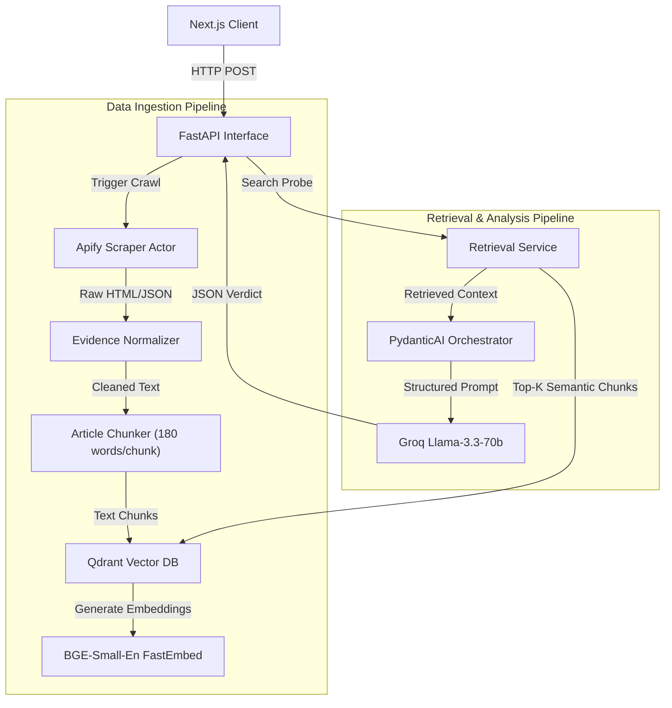

<div align="center">
  <h1 align="center">GreenTrace Backend</h1>
  <p align="center">
    <strong>The Evidence-Led Sustainability Scrutiny Engine</strong>
  </p>
  <p align="center">
    <a href="#-the-problem--solution">Problem & Solution</a> •
    <a href="#-system-architecture">Architecture</a> •
    <a href="#-tech-stack">Tech Stack</a> •
    <a href="#-api-reference">API Reference</a> •
    <a href="#-llm--pydanticai-orchestration">LLM Integration</a> •
    <a href="#-deployment-guide">Deployment</a>
  </p>
</div>

---

## 🌎 The Problem & Solution

Generic AI models hallucinate corporate sustainability data. When asked *"Is H&M's sustainability report accurate?"*, base LLMs often regurgitate the company's own marketing copy or invent metrics.

**GreenTrace** solves this through an autonomous, grounded Scrutiny Engine. The backend:
1. **Crawls** independent, third-party sources (NGO reports, investigative journalism).
2. **Embeds** this evidence semantically into a vector space.
3. **Retrieves** the most contradictory or supportive claims based on the user's specific probe.
4. **Synthesizes** a highly structured, objective verdict utilizing the `PydanticAI` framework and the Groq API for lightning-fast inference.

This ensures every claim the system makes is traced directly back to verifiable, external evidence.

---

## 🏗 System Architecture

The backend is built as a highly modular `FastAPI` application. The architecture strictly isolates concerns to allow seamless swapping of embedding models, LLM providers, or databases without rewriting core crawler logic.



### Component Deep Dive
- **`greentrace_actor.py`**: Interacts with the Apify API (`sama4/greentrace-scrapper`) to bypass anti-bot protections and scrape high-quality ESG news and NGO reports.
- **`evidence_normalizer.py`**: Strips boilerplate, standardizes URLs, and scores source reliability.
- **`article_chunker.py`**: Implements a sliding window algorithm (180 words, 40 overlap) to preserve semantic context across chunk boundaries.
- **`qdrant_store.py`**: The adapter for Qdrant. Handles collection initialization and upserting vectors via FastEmbed.
- **`pydanticai_orchestrator.py`**: The brain of the operation. Defines a strict `ESGAnalysis` JSON schema schema (Verdict, Details, Supporting/Contradicting Evidence) and enforces it on the Groq LLM.

---

## ⚡ Tech Stack

| Domain | Technology | Justification |
|--------|------------|---------------|
| **Core Framework** | `FastAPI` (Python 3.11+) | Asynchronous, typed, self-documenting (Swagger UI). |
| **Data Scraping** | `Apify Client` | Out-of-the-box stealth scraping and proxy rotation. |
| **Vector DB** | `Qdrant` | Highly scalable, optimized for dense vector search. |
| **Embeddings** | `FastEmbed` (`BAAI/bge-small-en`) | Runs natively in Python processes without heavy GPU overhead. |
| **LLM Orchestration** | `PydanticAI` | Guarantees structured JSON output; prevents LLM format drift. |
| **LLM Provider** | `Groq` (`llama-3.3-70b-versatile`) | LPU-accelerated inference for sub-second analysis generation. |

---

## 🛠 Quickstart Guide

### 1. Requirements
- Python 3.11+
- `uv` (Recommended) or standard `pip`

### 2. Environment Variables
Clone the repo and configure the variables.
```bash
cp .env.example .env
```
Populate `.env` with:
```env
# Apify (Web Scraping)
APIFY_TOKEN=your_apify_token
APIFY_ACTOR_ID=sama4/greentrace-scrapper
APIFY_TIMEOUT_SECS=300

# Qdrant (Vector Storage)
QDRANT_URL=your_qdrant_cluster_url
QDRANT_API_KEY=your_qdrant_api_key
QDRANT_COLLECTION_NAME=company_evidence

# Embedding Configuration
EMBEDDING_PROVIDER=qdrant-fastembed
EMBEDDING_MODEL_NAME=BAAI/bge-small-en
CHUNK_SIZE_WORDS=180
CHUNK_OVERLAP_WORDS=40

# LLM Agent
GROQ_API_KEY=your_groq_api_key
GROQ_MODEL=llama-3.3-70b-versatile
```

### 3. Installation & Run
```bash
# Using uv (fastest)
uv venv
source .venv/bin/activate
uv sync

# Run the API
uvicorn app.main:app --reload --host 127.0.0.1 --port 8000
```
Visit `http://localhost:8000/docs` to view the interactive OpenAPI documentation.

---

## 📖 Comprehensive API Reference

### 1. Data Ingestion Endpoint
`POST /evidence/companies/{company_name}/ingest`
- **Purpose**: Kicks off the entire Apify scraping, chunking, and Qdrant ingestion pipeline for a specific company.
- **Response**:
```json
{
  "company": "Nestle",
  "overall_status": "partial",
  "collection_name": "company_evidence",
  "article_count": 12,
  "chunk_count": 86,
  "source_breakdown": { "jina": 12 }
}
```

### 2. Semantic Retrieval Endpoint
`POST /evidence/retrieve`
- **Purpose**: Runs a similarity search in Qdrant based on a user's question.
- **Payload**:
```json
{
  "company": "Nestle",
  "question": "What do NGOs say about their plastic reduction claims?",
  "top_k": 5
}
```

### 3. LLM Orchestration & Analysis Endpoint
`POST /evidence/answer/mock`
- **Purpose**: The core analysis route. Retrieves chunks from Qdrant and passes them to the PydanticAI agent targeting the Groq LLM. It returns a fully grounded, structured JSON verdict.
- *(Note: Named 'mock' for legacy routing compatability, but runs the live LLM pipeline).*
- **Response**:
```json
{
  "company": "Nestle",
  "answer_status": "grounded",
  "answer": "Verdict: Partially Misleading. Claim: Nestle aims to make 100% of packaging recyclable... Supporting Evidence: [...] Contradicting Evidence: [...]",
  "evidence": [ ...raw semantic chunks... ]
}
```

---

## 🤖 LLM & PydanticAI Orchestration

Instead of brittle string prompting, GreenTrace utilizes **PydanticAI**.
By defining a rigid Pydantic basemodel (`ESGAnalysis`), we force the Groq model to return data in a predictable format that the React frontend can reliably parse.

```python
class ESGAnalysis(BaseModel):
    has_sufficient_info: bool
    verdict: Literal["Accurate", "Partially Misleading", "Highly Misleading", "Unknown"]
    analyzed_claim: str
    supporting_evidence: list[str]
    contradicting_evidence: list[str]
    sources_cited: list[str]
```
The overarching agent prompt explicitly enforces:
> *"You are an objective ESG analyst. Your ONLY source of truth is the provided chunked text. If the evidence does not support a conclusion, you must mark it 'Unknown'. You must not hallucinate external knowledge."*

---

## ☁️ Production Deployment (AWS EC2)

The application is configured to run flawlessly on an always-on **AWS EC2** instance via `systemd`.

### 1. AWS Configuration
- **Instance Type**: `t3.small` (Amazon Linux 2023)
- **Security Group**: Inbound rules for Port `22` (SSH) and Port `8000` (FastAPI).

### 2. User-Data Bootstrap Script
When launching the instance, pass the following User-Data script to automate the entire deployment (installs Python, clones the repo, generates `.env`, and setups the daemon).

```bash
#!/bin/bash
set -e
yum update -y
yum install -y python3.11 python3.11-pip git

# Clone & Environment
cd /home/ec2-user
git clone https://github.com/handegursoy/greentrace-ai
cd greentrace-ai/backend
# (Create .env file here based on requirements)

# Install Dependencies
python3.11 -m pip install -e ".[dev]" 

# Set Ownership
chown -R ec2-user:ec2-user /home/ec2-user/greentrace

# Configure systemd daemon
cat > /etc/systemd/system/greentrace.service << 'SVCEOF'
[Unit]
Description=GreenTrace FastAPI Backend
After=network.target

[Service]
Type=simple
User=ec2-user
WorkingDirectory=/home/ec2-user/greentrace/backend
ExecStart=/usr/bin/python3.11 -m uvicorn app.main:app --host 0.0.0.0 --port 8000
Restart=always
RestartSec=5

[Install]
WantedBy=multi-user.target
SVCEOF

systemctl daemon-reload
systemctl enable greentrace
systemctl start greentrace
```

### 3. Server Management
To view live logs from the LLM or Scraper on the EC2 instance:
```bash
journalctl -u greentrace.service -f
```
To restart the application after pulling new code:
```bash
sudo systemctl restart greentrace
```

---
