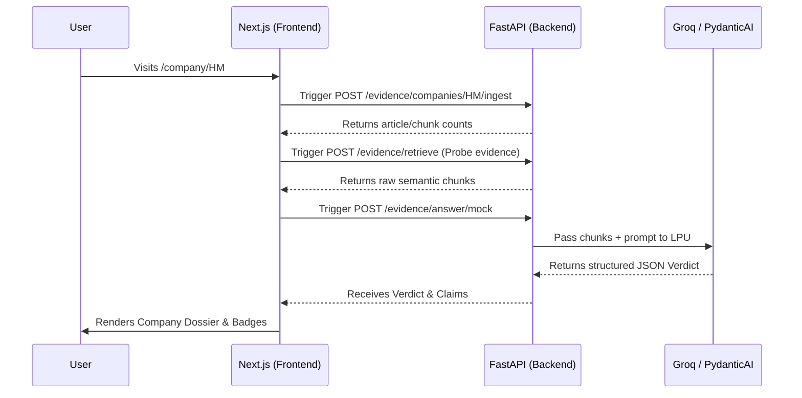

<div align="center">
  <h1 align="center">GreenTrace Frontend</h1>
  <p align="center">
    <strong>Sleek, Dynamic, and Evidence-Led ESG Scrutiny</strong>
  </p>
  <p align="center">
    <a href="#-the-vision">The Vision</a> •
    <a href="#-core-features--ux">Core Features</a> •
    <a href="#-architecture--data-flow">Architecture</a> •
    <a href="#-tech-stack">Tech Stack</a> •
    <a href="#-mixed-content-security-proxy">The Security Proxy</a> •
    <a href="#-vercel-deployment">Vercel Deployment</a>
  </p>
</div>

---

## 🌟 The Vision

Corporate sustainability pages inherently tell one side of the story. The **GreenTrace Frontend** is designed to pierce through marketing jargon with a premium, dynamic interface. 

Built with Next.js and Tailwind CSS, the application moves away from simple "chat" interfaces. Instead, it generates a comprehensive **Company Dossier**, presenting the user with a high-level LLM synthesis alongside the raw semantic chunks retrieved from NGOs, journalists, and whistleblowers.

If a company makes a claim, GreenTrace provides the receipts.

---

## ✨ Core Features & UX

- **Dynamic Company Dossiers:** Navigating to `/company/[name]` instantly generates a dashboard. The server-rendered shell loads immediately, while client-side components hydrate the data dynamically.
- **Asynchronous Ingestion Status:** Web scraping and embedding take time. The UI displays real-time loading states and handles polling for the `ingest` routes automatically, keeping the user informed of background processing.
- **Evidence Carousel:** "Grounded" claims aren't hidden behind a black box. Users can click through the exact text chunks (with source links) that the Groq LLM used to make its verdict.
- **Stance Badging:** Visual indicators (Supports, Contradicts, Questions) allow users to skim the consensus of external entities against internal claims.

---

## 🏗 Architecture & Data Flow



### Key Directories
- `app/company/[name]/page.js`: The entry point for the dossier. Handles Server-Side Rendering (SSR) of initial layout and SEO meta-tags.
- `app/company/[name]/CompanyInsightsClient.js`: The heavy lifter. A React Client Component that orchestrates the data fetching, state management, and interaction flows.
- `app/lib/greentrace-api.js`: The central API client. Consolidates all backend communication and logic for parsing the FastAPI endpoints.

---

## ⚡ Tech Stack

| Technology | Purpose |
|------------|---------|
| **Next.js 15+** | React framework utilizing the cutting-edge App Router for hybrid SSR/CSR rendering. |
| **Tailwind CSS v4** | Utility-first styling for rapid, responsive layout development. CSS Modules are used for scoped component styles when necessary. |
| **React Hooks** | `useState`, `useEffect`, and `useMemo` handle the complex cascading asynchronous requests required for vector retrieval. |
| **Vercel** | Edge-network hosting providing zero-config CI/CD. |

---

## 🚀 Quickstart Guide

### 1. Environment Setup
Clone the repository and move to the `frontend` directory.
Create a `.env.local` file at the root of `frontend/`:
```bash
NEXT_PUBLIC_BACKEND_API_URL=http://localhost:8000
```
*(If connecting to the live AWS EC2 backend, use its public IP, e.g., `http://3.235.253.57:8000`)*

### 2. Install Packages
```bash
yarn install
```

### 3. Run Development Server
```bash
yarn run dev
```
Navigate to [http://localhost:3000](http://localhost:3000) to view the application.

---

## 🛡 The Mixed Content Security Proxy

**The Problem:** The Next.js frontend is deployed on Vercel utilizing secure HTTPS. The backend runs on an AWS EC2 instance over standard HTTP. Modern browsers strictly block HTTP requests originating from HTTPS websites (**Mixed Content Error**).

**The Solution:** Instead of configuring complex Nginx SSL certificates on temporary EC2 instances, GreenTrace utilizes Next.js's native Edge infrastructure to proxy the requests securely.

In `next.config.js`, we define a `rewrite` rule:
```javascript
  async rewrites() {
    return [
      {
        source: "/api/backend/:path*",
        destination: `${process.env.NEXT_PUBLIC_BACKEND_API_URL}/:path*`, 
      },
    ];
  }
```

In `lib/greentrace-api.js`, the fetch base is dynamically adjusted:
```javascript
const API_BASE =
  typeof window === "undefined"
    ? process.env.NEXT_PUBLIC_BACKEND_API_URL // Server-side (direct, permitted by Vercel)
    : "/api/backend"; // Client-side (proxied through the browser)
```
This entirely maps the insecure HTTP requests through the secure Vercel Edge, seamlessly bypassing browser restrictions!

---

## ☁️ Vercel Deployment

Deploying the frontend requires specific configurations since the Next.js app is located within a monorepo subdirectory (`frontend/`).

1. Link the repository to your Vercel account.
2. Under **Project Settings -> General**:
   - **Root Directory**: Set to `frontend`.
   - **Framework Preset**: Ensure it is detected as `Next.js`.
3. Under **Project Settings -> Environment Variables**:
   - Key: `NEXT_PUBLIC_BACKEND_API_URL`
   - Value: `http://YOUR_EC2_IP:8000` (e.g., `http://3.235.253.57:8000`)
4. Trigger a manual **Redeploy**.
